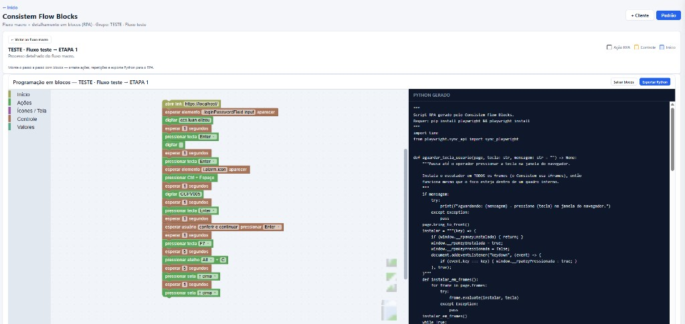

# Rapidsoft Flow Blocks

Editor de **fluxogramas macro** + **processo detalhado em blocos** (Blockly) com **exportação Python** para RPA (Playwright).

O fluxo macro continua sendo diagrama (XYFlow). Ao abrir o detalhe de uma etapa, o editor vira blocos visuais: clicar, digitar, teclas, atalhos, esperar, condições — com pré-visualização e download do `.py`.



Stack: **HTML/JS** + **React/Vite** + **Blockly** + [XYFlow](https://reactflow.dev/).

---

## O que dá para fazer

| Recurso | Descrição |
|---------|-----------|
| **Grupos e fluxos** | Vários grupos (ex.: PCP - MACRO, Faturamento); cada grupo pode ter um ou mais fluxos macro |
| **Fluxo padrão** | Sequência base compartilhada por todos os clientes do grupo |
| **Clientes** | Customizações sobre o padrão: etapas extras, puladas, decisões, gatilhos, subfluxos |
| **Processo detalhado (Blockly)** | Ações RPA por blocos + export **Python** (Playwright) |
| **Blocos RPA** | Abrir URL, clicar, digitar, teclas F1–F12, atalhos (Alt/Ctrl+letra), esperar elemento, esperar usuário na tela, captura de tela |
| **Export** | PNG, Mermaid e **Python** |
| **Persistência** | `localStorage` + JSON exportável; em dev, grava em `data/rapidsoft-flow-blocks-config.json` |

---

## Requisitos e instalação

- [Node.js](https://nodejs.org/) **18+**
- Para rodar scripts exportados: `pip install playwright` e `playwright install`

```bash
cd "Rapidsoft Flow Blocks"
npm install
npm run dev
```

| URL | Tela |
|-----|------|
| http://localhost:5173/index.html | **Capa** — grupos, fluxos, clientes, processos |
| http://localhost:5173/fluxo.html | **Diagrama** — fluxo macro + detalhe em blocos |

---

## Fluxo RPA (Blockly)

1. Abra uma etapa no diagrama macro → **Detalhar** / **Abrir**.
2. Monte o processo com blocos na paleta (Início, Ações, Ícones/Tela, Controle).
3. Use **Salvar blocos** para persistir no JSON do processo.
4. Use **Exportar Python** para baixar o script Playwright.

### Blocos principais

| Bloco | Uso |
|-------|-----|
| **abrir link** | `page.goto` com HTTPS local ignorado no export |
| **digitar no campo** | Preenche campo por seletor CSS (`#btConfirma`, `.loginTextField input`) |
| **pressionar atalho** | Alt/Ctrl/Shift + letra ou tecla |
| **esperar elemento aparecer** | Aguarda seletor CSS (`i.alarm.icon`, `input[data-widget-id="..."]`) |
| **esperar usuário pressionar tecla** | Pausa até Enter/Esc na janela (funciona em iframes) |
| **clicar em** | Clica no primeiro elemento visível do seletor |

### Rodar o Python exportado

```powershell
cd $env:USERPROFILE\Downloads
python "rpa-meu-processo-2026-07-03.py"
```

Use aspas se o nome do arquivo tiver espaços ou `(3)`.

---

## Comandos

| Comando | O que faz |
|---------|-----------|
| `npm run dev` | Servidor de desenvolvimento (Vite) |
| `npm run build` | Typecheck + build em `dist/` |
| `npm run preview` | Serve o build localmente |
| `npm run test:store` | Testes automatizados da lógica de fluxo |

---

## Estrutura do projeto

| Pasta / arquivo | Conteúdo |
|-----------------|----------|
| `index.html` + `js/capa.js` | Tela inicial |
| `fluxo.html` + `src/App.tsx` | Diagrama React + Blockly |
| `src/blocks/rpaBlocks.ts` | Definição dos blocos RPA |
| `src/lib/rpaPythonGenerator.ts` | Gerador Python (Playwright) |
| `src/components/BlocklyWorkspace.tsx` | Editor Blockly |
| `js/store.js` | Estado, merge cliente, persistência |
| `data/rapidsoft-flow-blocks-config.json` | Snapshot do fluxo (dev/Git) |
| `docs/CONTEXTO-PROJETO.md` | Referência técnica |
| `test/` | Roteiros manuais e testes `.mjs` |

---

## Persistência e Git

Em desenvolvimento (`npm run dev`), o app grava automaticamente em:

```
data/rapidsoft-flow-blocks-config.json
```

---

## Licença e repositório

Projeto Rapidsoft · [GitHub — rapidsoft-flow](https://github.com/LuanElizeuSantos/rapidsoft-flow)
